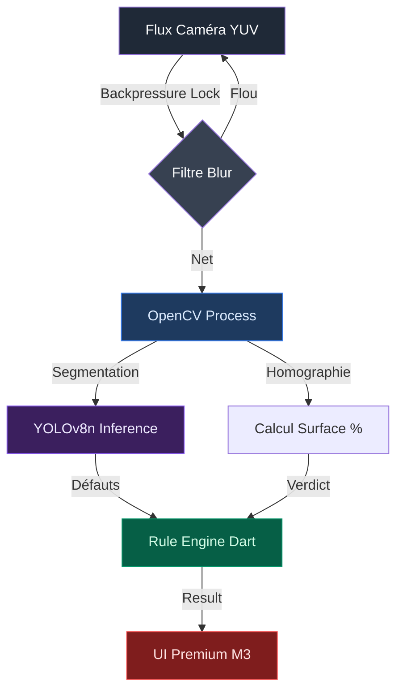
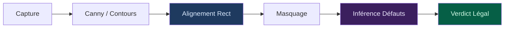

<div align="center">

<br/>

```
███╗   ███╗ ██████╗ ███╗   ██╗███╗   ██╗ █████╗ ██╗███████╗ ██████╗██╗  ██╗███████╗ ██████╗██╗  ██╗
████╗ ████║██╔═══██╗████╗  ██║████╗  ██║██╔══██╗██║██╔════╝██╔════╝██║  ██║██╔════╝██╔════╝██║ ██╔╝
██╔████╔██║██║   ██║██╔██╗ ██║██╔██╗ ██║███████║██║█████╗  ██║     ███████║█████╗  ██║     █████╔╝ 
██║╚██╔╝██║██║   ██║██║╚██╗██║██║╚██╗██║██╔══██║██║██╔══╝  ██║     ██║  ██║██╔══╝  ██║     ██║  ██╗
██║ ╚═╝ ██║╚██████╔╝██║ ╚████║██║ ╚████║██║  ██║██║███████╗╚██████╗██║  ██║███████╗╚██████╗██║   ██╗
╚═╝     ╚═╝ ╚═════╝ ╚═╝  ╚═══╝╚═╝  ╚═══╝╚═╝  ╚═╝╚═╝╚══════╝ ╚═════╝╚═╝  ╚═╝╚══════╝ ╚═════╝╚═╝   ╚═╝
```

**MonnaieCheck — Validateur offline de billets & pièces FCFA (Loi Bénin 2026)**

<br/>


<br/>

</div>

---

> **MonnaieCheck protège les commerçants et les citoyens.**
> Une solution "Offline-First" pour valider la conformité des billets et pièces FCFA selon la loi béninoise du **22 mai 2026** et les directives de la BCEAO.

---

## Vue d'ensemble

Dans un contexte de renforcement de la légalité monétaire au Bénin, **MonnaieCheck** fournit un verdict instantané et incontestable sur l'état d'un billet ou d'une pièce. L'application est conçue pour fonctionner sur des smartphones d'entrée de gamme (Infinix, Tecno, itel) sans aucune connexion internet, garantissant confidentialité et rapidité sur les marchés.

### Optimisations Critiques pour le Terrain (v1.0.0)

L'application intègre un pipeline de vision hybride optimisé pour les ressources limitées (1-2 Go RAM) :
- **Conversion Native YUV ↔ RGB** : Bypass des boucles Dart pour un traitement mémoire direct via OpenCV FFI.
- **Filtre de Netteté Dynamique** : Analyse de la variance du Laplacien pour rejeter les images floues avant l'inférence IA.
- **Gestion du Backpressure** : Verrou asynchrone empêchant l'accumulation de frames et les crashs OOM (Out Of Memory).
- **Auto-Torch adaptatif** : Analyse d'histogramme en temps réel pour compenser le manque de lumière dans les marchés couverts.

---

## Architecture Technique

MonnaieCheck repose sur une architecture en trois couches combinant vision classique et apprentissage profond.



| Composant | Technologie | Rôle |
| :--- | :--- | :--- |
| **Logic Engine** | Dart | Implémentation stricte des articles de loi (Surface $\ge 50\%$, etc.) |
| **CV Engine** | OpenCV C++ | Géométrie, redressement de perspective, calcul de surface |
| **AI Engine** | TFLite / YOLO | Détection de taches, scotchs, écritures et usure des pièces |
| **OCR Engine** | ML Kit | Extraction du numéro de série pour traçabilité locale |

---

## Pipeline de Validation

### Analyse des Billets — Rigueur Géométrique



**Conformité Stricte :** L'application affiche explicitement l'article de loi et l'amende encourue (100k - 500k FCFA) en cas de refus injustifié par un commerçant d'un billet classé "Acceptation Obligatoire".

---

## Sécurité & Performance

| Propriété | Implémentation |
| :--- | :--- |
| **Offline-First** | Aucun appel API externe — Modèles embarqués en INT8 |
| **Stabilité RAM** | ImageStream capé à 720p pour préserver le CPU MediaTek |
| **Latence** | Pipeline complet < 150ms sur processeurs ARM low-cost |
| **Transparence** | Affichage en temps réel des "Bounding Boxes" de défaillances |

---

## Installation & Build

### Prérequis
- Flutter SDK (utilisez le SDK local configuré dans `/home/aurel/CODE/flutter_sdk`)
- Android NDK (pour `opencv_dart` FFI)

### Execution
```bash
# Configuration du PATH
export PATH="/home/aurel/CODE/flutter_sdk/bin:$PATH"

# Dépendances
flutter pub get

# Lancement
flutter run --release
```

---

<div align="center">

**MonnaieCheck** · Protéger l'économie, un billet à la fois.


</div>
